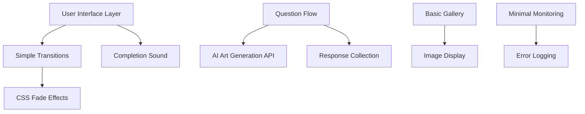
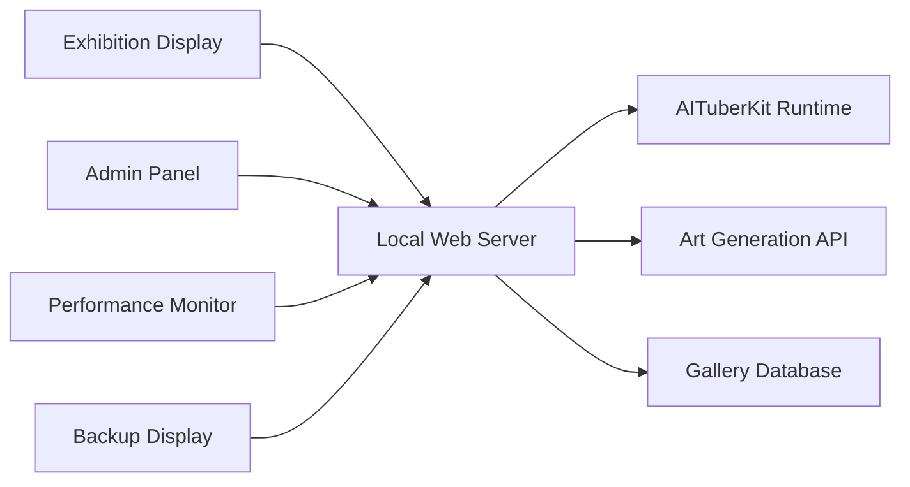

# Design Document

## Overview

The TalkArt system is a simplified interactive AI artist experience designed to create personalized summer festival memory artwork through conversational interaction. The system provides a quick 60-90 second experience featuring minimal animations, AI art generation, and a basic gallery display.

The design prioritizes absolute minimal development with only essential features: simple CSS fade transitions, a single completion sound, and basic UI interactions. The system is optimized for quick deployment in exhibition environments.

## Architecture

### System Architecture Overview



### Core Components

1. **Experience Flow Controller**: Orchestrates the 4-phase user experience timeline (Start → Questions → Generation → Result)
2. **Animation System**: Simple CSS fade transitions only
3. **Audio Manager**: Single completion sound effect
4. **Art Generation Pipeline**: Manages conversation processing and AI artwork creation
5. **Gallery System**: Basic artwork display
6. **Performance Monitor**: Minimal resource tracking

## Components and Interfaces

### 1. Character Controller (Removed)

```typescript
// Character features removed for simplified version
// Static background image will be used instead
```

### 2. Experience Flow Manager (Simplified)

```typescript
interface ExperienceFlowManager {
  // Phase management
  startExperience(): Promise<void>
  nextPhase(): Promise<void>
  reset(): void
}

enum ExperiencePhase {
  START = 'start',
  QUESTIONS = 'questions', 
  GENERATION = 'generation',
  RESULT = 'result'
}
```

### 3. Animation System (Simplified)

```typescript
interface AnimationSystem {
  // CSS Animation control only
  fadeIn(element: HTMLElement, duration?: number): Promise<void>
  fadeOut(element: HTMLElement, duration?: number): Promise<void>
  
  // Simple loading indicator
  showLoadingSpinner(): void
  hideLoadingSpinner(): void
  
  // Basic button feedback
  buttonPressEffect(button: HTMLElement): void
}
```

### 4. Audio Manager (Minimal)

```typescript
interface AudioManager {
  // Single completion sound only
  playCompletionSound(): Promise<void>
}
```

### 5. Art Generation Pipeline

```typescript
interface ArtGenerationPipeline {
  // Conversation processing
  processConversation(responses: ConversationResponse[]): ConversationSummary
  
  // Art generation
  generateArtwork(summary: ConversationSummary): Promise<GeneratedArtwork>
  
  // Progress tracking
  onGenerationProgress(callback: (progress: number) => void): void
}

interface ConversationResponse {
  question: string
  selectedAnswer: string
  timestamp: number
}

interface GeneratedArtwork {
  imageUrl: string
  prompt: string
  metadata: ArtworkMetadata
}
```

### 6. Gallery System

```typescript
interface GallerySystem {
  // Artwork management
  addArtwork(artwork: GeneratedArtwork): Promise<void>
  getRecentArtworks(limit?: number): Promise<GeneratedArtwork[]>
  
  // Real-time updates
  subscribeToUpdates(callback: (artwork: GeneratedArtwork) => void): void
  
  // Display animations
  animateArtworkAddition(artwork: GeneratedArtwork): Promise<void>
  rearrangeGallery(): Promise<void>
}
```

## Data Models

### Core Data Structures

```typescript
// User session data
interface UserSession {
  sessionId: string
  startTime: Date
  currentPhase: ExperiencePhase
  conversationResponses: ConversationResponse[]
  generatedArtwork?: GeneratedArtwork
}

// Artwork metadata
interface ArtworkMetadata {
  createdAt: Date
  sessionId: string
  generationTime: number
  artStyle: string
  themes: string[]
}

// System configuration
interface SystemConfig {
  // Performance settings
  targetFPS: number
  enableGPUAcceleration: boolean
  
  // Audio settings
  volumes: {
    bgm: number
    se: number
    voice: number
  }
  
  // Animation settings
  animationSpeed: number
  skipAnimations: boolean
  
  // Debug settings
  debugMode: boolean
  showFPS: boolean
}

// Conversation flow definition
interface ConversationFlow {
  questions: ConversationQuestion[]
  maxDuration: number
  timeoutBehavior: 'skip' | 'repeat' | 'end'
}

interface ConversationQuestion {
  id: string
  text: string
  options: string[]
  characterMotion?: CharacterMotion
  backgroundEffect?: string
}
```

## Error Handling

### Error Categories and Responses

```typescript
enum ErrorType {
  NETWORK_ERROR = 'network_error',
  GENERATION_FAILED = 'generation_failed',
  AUDIO_LOAD_FAILED = 'audio_load_failed',
  CHARACTER_LOAD_FAILED = 'character_load_failed',
  PERFORMANCE_DEGRADED = 'performance_degraded'
}

interface ErrorHandler {
  handleError(error: SystemError): Promise<void>
  recoverFromError(errorType: ErrorType): Promise<boolean>
  logError(error: SystemError): void
}

interface SystemError {
  type: ErrorType
  message: string
  timestamp: Date
  context: any
  recoverable: boolean
}
```

### Error Recovery Strategies

1. **Network Errors**: Retry with exponential backoff, show offline mode
2. **Generation Failures**: Restart conversation, provide fallback artwork
3. **Audio Load Failures**: Continue without audio, show visual-only mode
4. **Character Load Failures**: Use fallback static character, maintain functionality
5. **Performance Issues**: Reduce animation complexity, disable non-essential effects

## Testing Strategy

### Testing Approach

1. **Unit Testing**
   - Individual component functionality
   - Animation timing and sequencing
   - Audio playback and synchronization
   - Error handling and recovery

2. **Integration Testing**
   - AITuberKit integration
   - Art generation API integration
   - Real-time gallery updates
   - Cross-browser compatibility

3. **Performance Testing**
   - 60fps animation maintenance
   - Memory usage monitoring
   - Asset loading optimization
   - Concurrent user handling

4. **User Experience Testing**
   - Complete experience flow (90-120 seconds)
   - Audio-visual synchronization
   - Touch/click responsiveness
   - Gallery interaction smoothness

### Test Scenarios

```typescript
// Performance test scenarios
interface PerformanceTestScenario {
  name: string
  duration: number
  expectedFPS: number
  memoryThreshold: number
  actions: TestAction[]
}

// Example scenarios
const TEST_SCENARIOS: PerformanceTestScenario[] = [
  {
    name: 'Complete User Experience',
    duration: 120000, // 2 minutes
    expectedFPS: 60,
    memoryThreshold: 100, // MB
    actions: [
      { type: 'start_experience', timestamp: 0 },
      { type: 'select_responses', timestamp: 15000 },
      { type: 'generate_artwork', timestamp: 45000 },
      { type: 'view_gallery', timestamp: 90000 }
    ]
  },
  {
    name: 'Continuous Gallery Updates',
    duration: 300000, // 5 minutes
    expectedFPS: 60,
    memoryThreshold: 150, // MB
    actions: [
      { type: 'simulate_gallery_additions', interval: 10000 }
    ]
  }
];
```

### Automated Testing Framework

```typescript
interface TestFramework {
  // Performance monitoring
  startPerformanceMonitoring(): void
  stopPerformanceMonitoring(): PerformanceReport
  
  // Animation testing
  validateAnimationTiming(animation: string, expectedDuration: number): boolean
  checkFrameRate(duration: number): number
  
  // Audio testing
  validateAudioSync(audioTrack: string, visualCue: string): boolean
  checkAudioLevels(): AudioLevelReport
  
  // Integration testing
  testAITuberKitIntegration(): Promise<boolean>
  testArtGenerationAPI(): Promise<boolean>
}
```

## Performance Optimization

### Rendering Optimization

1. **GPU Acceleration**: Use CSS transforms and will-change properties
2. **Animation Batching**: Group DOM updates using requestAnimationFrame
3. **Asset Preloading**: Load critical assets during idle state
4. **Memory Management**: Clean up unused resources between sessions

### Resource Management

```typescript
interface ResourceManager {
  // Asset management
  preloadAssets(assets: AssetList): Promise<void>
  unloadUnusedAssets(): void
  
  // Memory monitoring
  getMemoryUsage(): MemoryReport
  triggerGarbageCollection(): void
  
  // Performance adaptation
  adaptToPerformance(metrics: PerformanceMetrics): void
}

interface PerformanceMetrics {
  currentFPS: number
  memoryUsage: number
  cpuUsage: number
  networkLatency: number
}
```

### Adaptive Quality System

The system automatically adjusts visual quality based on performance:

- **High Performance**: All animations and effects enabled
- **Medium Performance**: Reduce particle count, simplify animations
- **Low Performance**: Disable non-essential effects, use static backgrounds
- **Critical Performance**: Minimal animations, focus on core functionality

## Security Considerations

### Data Privacy
- No personal data storage beyond session duration
- Artwork metadata anonymized
- Optional QR code sharing (user consent)

### Content Safety
- AI generation content filtering
- Inappropriate content detection
- Family-friendly exhibition environment

### System Security
- API key protection
- Rate limiting for art generation
- Input sanitization for conversation responses

## Deployment Architecture

### Exhibition Setup



### System Requirements

- **Hardware**: Modern tablet/display with touch capability
- **Browser**: Chrome/Safari with WebGL support
- **Network**: Stable internet for AI art generation
- **Storage**: 1GB local storage for assets and temporary data
- **Audio**: Speakers or headphones for full experience

This design provides a comprehensive foundation for implementing the TalkArt system while maintaining the simplicity and performance requirements outlined in the original specification.