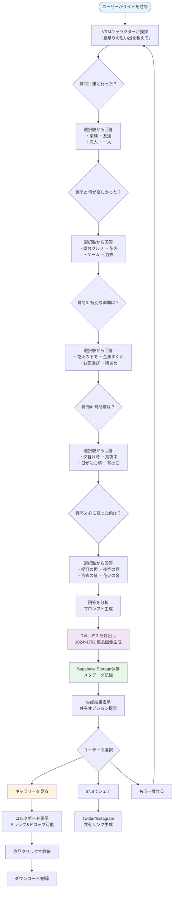
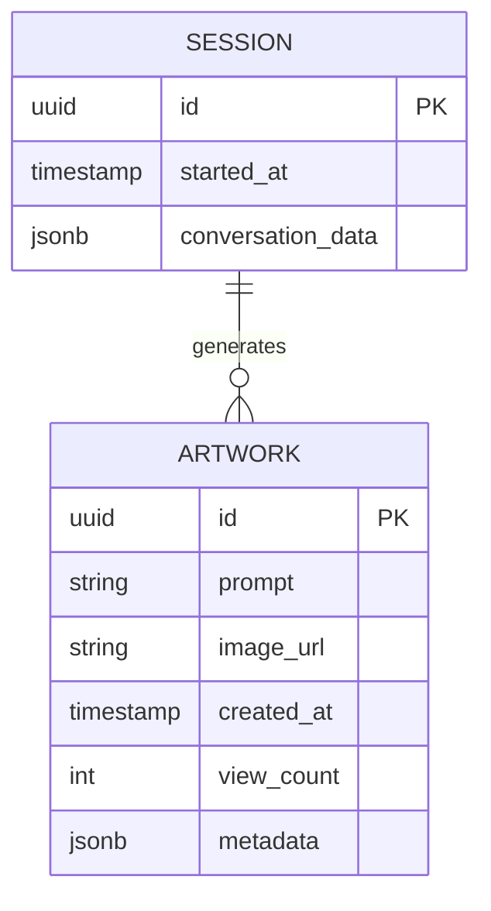
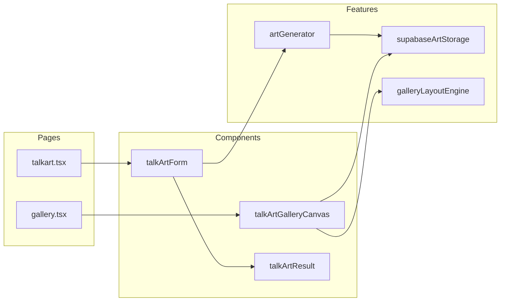

# TalkArt アーキテクチャ図

## システム全体構成

```mermaid
graph TB
    subgraph "フロントエンド"
        UI[ユーザーインターフェース<br/>Next.js + React]
        VRM[VRMキャラクター<br/>@pixiv/three-vrm]
        Gallery[ギャラリー表示<br/>React Konva]
        Form[会話フォーム<br/>質問フロー管理]
    end

    subgraph "バックエンド API"
        API[Next.js API Routes]
        GenAPI[/api/talkart/generate]
        ProxyAPI[/api/talkart/proxy-image]
    end

    subgraph "AI サービス"
        DALLE[DALL-E 3<br/>画像生成]
        GPT[GPT-4<br/>会話AI]
    end

    subgraph "データストレージ"
        Supabase[(Supabase)]
        Storage[Supabase Storage<br/>画像保存]
        DB[PostgreSQL<br/>メタデータ]
    end

    subgraph "リアルタイム機能"
        Realtime[Supabase Realtime<br/>リアルタイム更新]
    end

    %% フロー
    UI --> Form
    Form --> VRM
    Form --> API
    API --> GPT
    API --> GenAPI
    GenAPI --> DALLE
    DALLE --> Storage
    Storage --> Gallery
    DB --> Gallery
    Gallery --> UI
    Realtime --> Gallery

    %% ロゴ合成
    Gallery -.->|ロゴ合成<br/>クライアント側| UI

    classDef frontend fill:#e1f5ff,stroke:#0288d1
    classDef backend fill:#fff3e0,stroke:#f57c00
    classDef ai fill:#f3e5f5,stroke:#7b1fa2
    classDef storage fill:#e8f5e9,stroke:#388e3c
    
    class UI,VRM,Gallery,Form frontend
    class API,GenAPI,ProxyAPI backend
    class DALLE,GPT ai
    class Supabase,Storage,DB,Realtime storage
```

## ユーザー体験フロー



## データモデル



## コンポーネント相関図



## 技術仕様

- **画像生成**: DALL-E 3 (1024x1792 縦長ポートレート)
- **ロゴ合成**: Canvas API (クライアントサイド、30%サイズ)
- **ギャラリー表示**: React Konva (グリッドレイアウト)
- **データ保存**: Supabase (PostgreSQL + Storage)
- **リアルタイム更新**: Supabase Realtime
- **フロントエンド**: Next.js 14.2.5 + React 18.3.1
- **3Dアバター**: @pixiv/three-vrm

## ディレクトリ構造

```
src/
├── components/
│   ├── talkArtForm.tsx          # 会話フォーム
│   ├── talkArtGalleryCanvas.tsx # ギャラリー表示
│   └── talkArtResult.tsx        # 結果表示
├── features/talkart/
│   ├── artGenerator.ts           # アート生成ロジック
│   ├── supabaseArtStorage.ts    # データ永続化
│   └── galleryLayoutEngine.ts   # レイアウト管理
├── pages/
│   ├── talkart.tsx              # メインページ
│   └── api/talkart/
│       └── generate.ts          # 生成API
└── utils/
    └── logoComposer.ts          # ロゴ合成ユーティリティ
```

---

## 閲覧方法

このファイルを見るには：

1. **GitHub**: GitHubにプッシュすると自動的に図が表示されます
2. **VSCode**: Mermaid拡張機能をインストールすると図が見れます
3. **オンラインビューア**: 
   - [Mermaid Live Editor](https://mermaid.live/)
   - [GitHub Gist](https://gist.github.com/) に貼り付け
4. **Markdown Preview Enhanced**: VSCode拡張機能