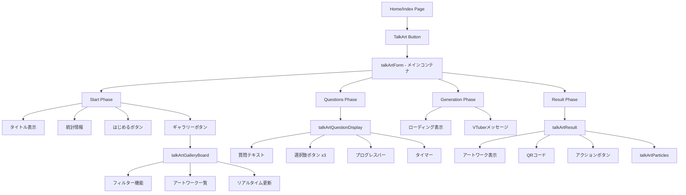
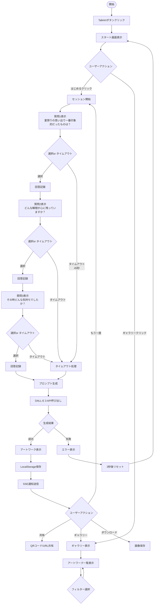
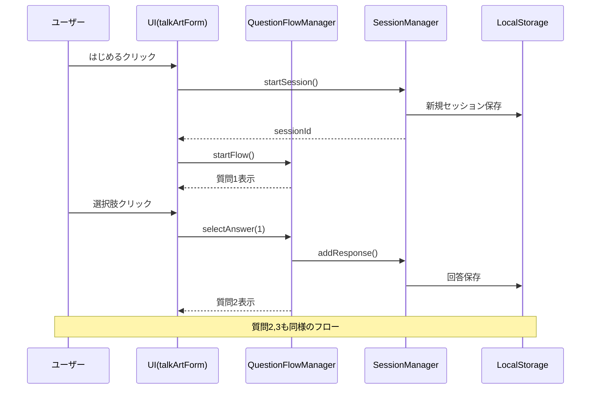
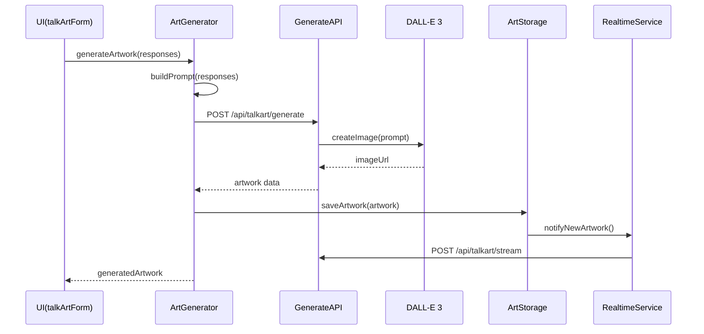

# TalkArt 詳細システム仕様書

## 目次
1. [概要](#概要)
2. [システムアーキテクチャ](#システムアーキテクチャ)
3. [ユーザーインターフェース](#ユーザーインターフェース)
4. [ユーザーフロー](#ユーザーフロー)
5. [バックエンドアーキテクチャ](#バックエンドアーキテクチャ)
6. [データフロー](#データフロー)
7. [API仕様](#api仕様)
8. [データモデル](#データモデル)
9. [技術スタック](#技術スタック)
10. [設定とデプロイメント](#設定とデプロイメント)

## 概要

TalkArtは、AITuberKitをベースに構築された対話型AIアーティストシステムです。ユーザーが夏祭りの思い出について3つの質問に答えることで、パーソナライズされたアートワークをAI（DALL-E 3）が生成します。

### 主要機能
- 60-90秒の短い体験時間
- 3つの質問による対話的な体験
- AI（DALL-E 3）によるアート生成
- リアルタイムギャラリー機能
- 手作り掲示板風のアートワーク展示
- QRコードによる共有機能

## システムアーキテクチャ

### プロジェクト構造
```
TalkArt-old/
├── aituber-kit/               # メインアプリケーションディレクトリ
│   ├── src/
│   │   ├── components/        # UIコンポーネント
│   │   │   ├── talkArtForm.tsx
│   │   │   ├── talkArtQuestionDisplay.tsx
│   │   │   ├── talkArtResult.tsx
│   │   │   ├── talkArtGalleryBoard.tsx
│   │   │   └── ...
│   │   ├── features/talkart/  # ビジネスロジック
│   │   │   ├── questionFlowManager.ts
│   │   │   ├── artGenerator.ts
│   │   │   ├── artStorage.ts
│   │   │   └── ...
│   │   ├── pages/api/talkart/ # APIエンドポイント
│   │   │   ├── generate.ts
│   │   │   ├── stream.ts
│   │   │   └── share/[id].ts
│   │   └── styles/
│   │       └── talkart.css
│   └── public/
│       ├── images/
│       └── sounds/
├── talkart.config.js          # TalkArt設定ファイル
└── CLAUDE.md                  # プロジェクトガイド
```

### コンポーネント階層



## ユーザーインターフェース

### 1. スタート画面
- **背景**: 夏祭りテーマの画像（`summer-festival-bg.jpg`）
- **メインタイトル**: 「夏祭りの思い出をアートにしよう」
- **統計表示**: 「これまで〇〇人の思い出がアートになりました」
- **アクションボタン**:
  - 「はじめる」: 黄色背景、白文字、glow効果
  - 「ギャラリー」: 紫背景、白文字、黄色枠線

### 2. 質問画面
- **レイアウト**: 中央寄せ、縦方向配置
- **要素**:
  - 進捗表示（例: 質問 1 / 3）
  - タイマー（時計アイコン付き）
  - プログレスバー（黄色〜オレンジのグラデーション）
  - 質問テキスト（大きなフォント）
  - 選択肢ボタン（3つ、横並び）
  - キーボードヒント

### 3. 生成中画面
- **ローディングアニメーション**: 回転するリング
- **メッセージ**: 「アートを生成中...」（跳ねるドット付き）
- **VTuberメッセージ**: 「あなたの思い出をアートに描いています...」

### 4. 結果画面
- **2カラムレイアウト**（デスクトップ）/ **1カラム**（モバイル）
- **左側**: アートワーク表示（白枠、glow効果）
- **右側**: 
  - QRコード
  - アクションボタン（共有、ギャラリー、もう一度）
  - プロンプト情報

### 5. ギャラリー画面
- **掲示板風デザイン**: コルクボード背景
- **アートワーク表示**: 
  - ランダム配置
  - テープ/ピン装飾
  - 回転角度のバリエーション
  - 影効果
- **フィルター機能**: 全て/今日/お気に入り
- **リアルタイム更新**: 新着作品の飛行アニメーション

## ユーザーフロー

### メインフローチャート



### タイムライン（90秒の体験）

```mermaid
gantt
    title TalkArt 体験タイムライン
    dateFormat X
    axisFormat %s秒
    
    section ユーザー体験
    スタート画面        :0, 5
    質問1（15秒）       :5, 15
    質問2（15秒）       :20, 15
    質問3（15秒）       :35, 15
    アート生成待機      :50, 10
    結果表示           :60, 30
    
    section システム処理
    セッション開始      :5, 1
    回答記録1          :19, 1
    回答記録2          :34, 1
    回答記録3          :49, 1
    プロンプト生成      :50, 2
    API呼び出し        :52, 8
    データ保存         :60, 2
    SSE通知           :62, 1
```



## バックエンドアーキテクチャ

### データフロー図

```mermaid
graph LR
    subgraph ユーザーインターフェース
        UI[talkArtForm]
        QD[QuestionDisplay]
        RD[ResultDisplay]
        GB[GalleryBoard]
    end
    
    subgraph ビジネスロジック層
        QFM[QuestionFlowManager]
        AG[ArtGenerator]
        AS[ArtStorage]
        SM[SessionManager]
        RS[RealtimeService]
    end
    
    subgraph APIエンドポイント
        GenAPI[/api/talkart/generate]
        StreamAPI[/api/talkart/stream]
    end
    
    subgraph 外部サービス
        DALLE[DALL-E 3 API]
        LS[(LocalStorage)]
    end
    
    UI --> QFM
    QFM --> SM
    UI --> AG
    AG --> GenAPI
    GenAPI --> DALLE
    AG --> AS
    AS --> LS
    AS --> RS
    RS --> StreamAPI
    StreamAPI --> GB
    RD --> AS
```

### API処理フロー

#### 1. アート生成 (`/api/talkart/generate`)

```typescript
// リクエスト
POST /api/talkart/generate
{
  "prompt": "生成されたプロンプトテキスト",
  "sessionId": "session_1234567890",
  "style": "summer_festival_watercolor"
}

// レスポンス
{
  "imageUrl": "https://oaidallenorthamerica.blob.core.windows.net/...",
  "prompt": "A beautiful watercolor painting...",
  "metadata": {
    "createdAt": "2024-01-01T12:00:00Z",
    "sessionId": "session_1234567890",
    "generationTime": 5234,
    "style": "summer_festival_watercolor",
    "model": "dall-e-3"
  }
}
```

#### 2. リアルタイム更新 (`/api/talkart/stream`)

```javascript
// SSE接続
const eventSource = new EventSource('/api/talkart/stream');

// イベント受信
eventSource.onmessage = (event) => {
  const data = JSON.parse(event.data);
  switch(data.type) {
    case 'new_artwork':
      // 新規アートワーク処理
      break;
    case 'ping':
      // キープアライブ
      break;
  }
};
```

## データフロー

### 1. 質問回答フロー



### 2. アート生成フロー



## API仕様

### 1. アート生成API

**エンドポイント**: `POST /api/talkart/generate`

**リクエストヘッダー**:
```
Content-Type: application/json
```

**リクエストボディ**:
```json
{
  "prompt": "string (required)",
  "sessionId": "string (required)",
  "style": "string (optional, default: 'summer_festival_watercolor')"
}
```

**レスポンス** (200 OK):
```json
{
  "imageUrl": "string",
  "prompt": "string",
  "metadata": {
    "createdAt": "ISO 8601 datetime",
    "sessionId": "string",
    "generationTime": "number (ms)",
    "style": "string",
    "model": "string",
    "demo": "boolean (optional)"
  }
}
```

**エラーレスポンス**:
- 400: Bad Request（必須パラメータ不足）
- 500: Internal Server Error（API失敗）

### 2. リアルタイムストリームAPI

**エンドポイント**: `GET /api/talkart/stream`

**レスポンスヘッダー**:
```
Content-Type: text/event-stream
Cache-Control: no-cache
Connection: keep-alive
```

**イベント形式**:
```
data: {"type":"new_artwork","artwork":{...}}\n\n
data: {"type":"ping"}\n\n
```

### 3. 共有API

**エンドポイント**: `GET /api/talkart/share/[id]`

**レスポンス**: HTML ページ（Open Graphメタタグ付き）

## データモデル

### 1. セッション (TalkArtSession)

```typescript
interface TalkArtSession {
  id: string;                    // session_[timestamp]_[random]
  startTime: Date;
  endTime?: Date;
  status: 'active' | 'completed' | 'timeout' | 'error';
  responses: Array<{
    questionId: string;
    answer: string;
    timestamp: Date;
  }>;
  generatedArtworkId?: string;
  metadata: {
    duration?: number;
    completionReason?: string;
    errorMessage?: string;
  };
}
```

### 2. アートワーク (StoredArtwork)

```typescript
interface StoredArtwork {
  // 基本情報
  id: string;                    // artwork_[timestamp]_[random]
  imageUrl: string;
  prompt: string;
  
  // メタデータ
  metadata: {
    createdAt: Date;
    sessionId: string;
    generationTime: number;
    style: string;
    themes: string[];
  };
  
  // 追加フィールド
  downloadUrl?: string;
  thumbnailUrl?: string;
  likes?: number;
  featured?: boolean;
}
```

### 3. 質問設定 (QuestionConfig)

```typescript
interface QuestionConfig {
  id: string;
  text: string;
  options: Array<{
    id: string;
    text: string;
    value: string;
  }>;
  timeLimit?: number;
}
```

## 技術スタック

### フロントエンド
- **フレームワーク**: Next.js 14 (App Router)
- **言語**: TypeScript
- **スタイリング**: Tailwind CSS
- **状態管理**: Zustand
- **アニメーション**: CSS Animations, Framer Motion
- **QRコード**: qrcode.js

### バックエンド
- **ランタイム**: Node.js
- **API**: Next.js API Routes
- **AI統合**: OpenAI API (DALL-E 3)
- **リアルタイム**: Server-Sent Events (SSE)

### データストレージ
- **メイン**: LocalStorage（ブラウザ）
- **セッション**: メモリ内（API）
- **制限**: 最大100アートワーク/50セッション

### 開発ツール
- **パッケージマネージャー**: npm
- **リンター**: ESLint
- **フォーマッター**: Prettier
- **ビルドツール**: Next.js built-in

## 設定とデプロイメント

### 環境変数

```bash
# TalkArt モード
NEXT_PUBLIC_TALKART_MODE="true"

# OpenAI API（必須）
NEXT_PUBLIC_ART_API_KEY="sk-..."
NEXT_PUBLIC_ART_API_ENDPOINT="dalle3"

# 背景画像
NEXT_PUBLIC_BACKGROUND_IMAGE_PATH="/images/summer-festival-bg.jpg"

# オプション
NEXT_PUBLIC_DEBUG_MODE="false"
NEXT_PUBLIC_DEMO_MODE="false"
```

### talkart.config.js

```javascript
module.exports = {
  experience: {
    totalDuration: 90,        // 秒
    phases: {
      questions: 45,
      generation: 10,
      result: 35
    }
  },
  questions: [
    // 質問設定
  ],
  artGeneration: {
    style: 'summer_festival_watercolor',
    themes: ['japanese', 'festival', 'nostalgic', 'warm']
  },
  gallery: {
    maxArtworks: 50,
    gridColumns: 5
  }
};
```

### デプロイメント手順

1. **ビルド**:
   ```bash
   cd aituber-kit
   npm install
   npm run build
   ```

2. **環境変数設定**:
   - `.env.local` ファイルを作成
   - 必要な環境変数を設定

3. **起動**:
   ```bash
   npm start  # 本番モード
   npm run dev  # 開発モード
   ```

### パフォーマンス最適化

1. **画像最適化**:
   - Next.js Image コンポーネント使用
   - WebP形式への自動変換

2. **コード分割**:
   - 動的インポート使用
   - ギャラリーコンポーネントの遅延読み込み

3. **キャッシング**:
   - 静的アセットのブラウザキャッシュ
   - API応答の適切なキャッシュヘッダー

### セキュリティ考慮事項

1. **API キー管理**:
   - サーバーサイドでのみ使用
   - 環境変数で管理

2. **入力検証**:
   - プロンプトのサニタイズ
   - セッションIDの検証

3. **レート制限**:
   - 同一IPからの過度なリクエスト制限
   - セッションベースの制限

## まとめ

TalkArtは、AITuberKitの拡張として実装された、ユーザーフレンドリーなAIアート生成システムです。夏祭りのテーマを中心に、短時間で楽しめる体験を提供し、生成されたアートワークは手作り掲示板風のギャラリーで共有されます。LocalStorageとSSEを活用した軽量な実装により、データベース不要で動作する点が特徴です。